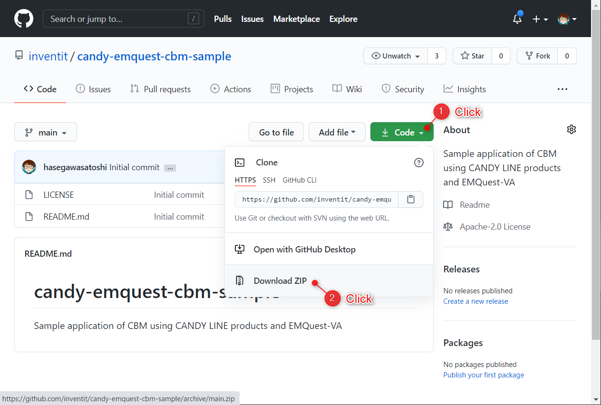

# はじめに

本アプリケーションは、CBM (Condition Based Maintenance) を行うために、振動解析装置を用いて、遠隔で装置・設備の状態監視を行うためのサンプルアプリケーションです。

本文書では、CANDY LINE社製の通信ボード CANDY Pi Lite および CANDY Pi Lite+ の全てのモデルに対する総称として、単に「CANDY Pi Lite」と記載します。

# システム要件

本アプリケーションを実行させるためには、以下の機器・環境が必要です。

* ユークエスト社製 [EMQuest-VA](https://www.uquest.co.jp/em/va.html)　（振動解析装置）
* Raspberry Pi [^1]
* CANDY LINE社製 [CANDY Pi Lite](https://candy-line.com/products/) （通信ボード）[^2]
* ACアダプタ
  * 出力電圧：5V
  * 出力電流：3Aまたは4A
  * プラグ形状：DCプラグ・ジャック
  * プラグ寸法：内径：φ2.1mm、外径：φ5.5mm
  * 極性：センタープラス
* microSD （16GB以上）
* nanoSIM [^3]
* CANDY LINE社製 [CANDY EGG](https://candy-line.com/) （クラウド環境）
* メールサーバー

# 機器・環境の準備

「システム要件」に記載された機器・環境を準備してください。機器 [^4] をまとめて購入したい場合は、株式会社マクニカの問い合わせフォーム [https://www.macnica.co.jp/business/semiconductor/support/contact/?product=Analog%20Devices](https://www.macnica.co.jp/business/semiconductor/support/contact/?product=Analog%20Devices) よりお問い合わせください。

CANDY EGG のご契約は、 [https://candy-line.com/](https://candy-line.com/) の「利用お申し込み」より、「フリートライアル」・「年間契約プラン」・「スポット利用」のいずれかを選び、お申し込みください。

回線契約の取次をご希望される方は、インヴェンティット株式会社の問い合わせフォーム[https://candy-line.com/contact/](https://candy-line.com/contact/) よりお問い合わせください。

アラートメールを送信するには、別途、メールサーバー (SMTP) が必要です。メールサーバーの `FQDN`, `ポート番号`, `ID`, `パスワード` を入手しておいてください。

# セットアップ

## CANDY Pi Lite のセットアップ

「CANDY Pi Lite/CANDY Pi Lite+ 利用ガイド」[https://github.com/CANDY-LINE/candy-pi-lite-info](https://github.com/CANDY-LINE/candy-pi-lite-info) および 「セットアップの仕方」[https://github.com/CANDY-LINE/candy-pi-lite-info/tree/master/setup](https://github.com/CANDY-LINE/candy-pi-lite-info/tree/master/setup) を参考に、 CANDY Pi Lite のセットアップを行ってください。

[OSイメージ](https://forums.candy-line.io/tags/os) は `v11.0.0` 以上をインストールしてください。

## アプリケーションのセットアップ

### ソースコードの取得

Github のリポジトリ [https://github.com/inventit/candy-emquest-cbm-sample](https://github.com/inventit/candy-emquest-cbm-sample) にアクセスし、ソースコードを取得してください。プルダウンリスト `Code` から `Download ZIP` を選択してください。

ダウンロードした ZIP ファイルを展開し、以下のファイルが含まれていることを確認してください。

* `src/candyegg_flow.json`
* `src/candyred_flow.json`

### CANDY EGG のセットアップ

CANDY EGG にお申込み後に取得できる `URL` にアクセスしてください。

CANDY EGG にお申込み後に取得できる `username` と `password` を用いてログインしてください。

右上のメニューアイコン `≡` をクリックし、 `import` - `Clipboard` を選択してください。

テキストエディタで `candyegg_flow.json` を開き、ダイアログにコピー＆ペーストしてください。

`Import to` として `new flow` を選択してください。

`CBMサンプル` というフローがインポートされます。

右下の方に `メール送信` というノードがあるので、ダブルクリックします。

編集画面が開くのでメールサーバーの情報を入力します。

* `To` : 空白にします
* `Server` : メールサーバー (SMTP Server) の FQDN を入力します。
* `Port` : メールサーバーのポート番号を入力します。
* `UserId` : メールを送信するためのユーザーIDを入力します。
* `Passowrd` : メールを送信するためのパスワードを入力します。

入力が完了したら `Done` をクリックします。

編集画面が閉じたら、右上の `Deploy` をクリックします。

確認ダイアログが表示されるので `Confirm deploy` をクリックします。

### 機器の接続

EMQuest-VA の電源を投入してください。4つ並んだ LED の一番右側と一番左側が点灯、真ん中の2つが消灯していることを確認してください。（EMQuest-VA の詳しい使用方法については製品マニュアルをご参照ください。）

CANDY Pi Lite に AC アダプタを接続し、電源を投入してください。電源投入後、しばらくしたのち、CANDY Pi Lite の2つ並んだ LED のうち、外側の橙色の LED が点滅していることを確認してください。CANDY Pi Lite のセットアップ方法については 「CANDY Pi Lite/CANDY Pi Lite+ 利用ガイド」[https://github.com/CANDY-LINE/candy-pi-lite-info](https://github.com/CANDY-LINE/candy-pi-lite-info) および 「セットアップの仕方」[https://github.com/CANDY-LINE/candy-pi-lite-info/tree/master/setup](https://github.com/CANDY-LINE/candy-pi-lite-info/tree/master/setup) をご参照ください。

EMQuest-VA に接続された USB 端子を、Raspberry Pi の USB ポートに挿しこんでください。挿しこむ先は、どのポートでも構いません。

### Raspberry Pi のセットアップ

Raspberry Pi と PC を有線 LAN または Wi-Fi で接続してください。

ウェブブラウザを起動し `http://raspberrypi:8100/` [^5] にアクセスしてください。
ログイン・ダイアログが表示されるので、`pi` / `raspberry` でログインしてください。

右上のメニューアイコン `≡` をクリックし、 `読み込み` を選択してください。

テキストエディタで `candyred_flow.json` を開き、ダイアログにコピー＆ペーストしてください。

`読み込み先` を `新規のタブ` に選択してください。

`CBMサンプル` というフローがインポートされます。

`CANDY EGG websocket IN` というノードをダブルクリックします。

`Account` の横の編集アイコンをクリックします。

編集画面が表示されるので、CANDY EGG のアカウント情報を入力してください。

* `Account FQDN` : CANDY EGG の URL をコピーすると `account@domain` の形式に変換されます。
* `User ID` : CANDY EGG のユーザーIDを入力します。
* `Password` : CANDY EGG のパスワードを入力します。

入力が完了したら `更新` ボタンをクリックします。

ノード編集画面に戻ったら `完了` をクリックします。

`デプロイ` をクリックします。

`EMQuest-VA` ノードのステータスが `connected` となっていれば、 EMQuest-VA との接続に成功しています。

`disconnected` まま変化しない場合は、以下の手順を試してください。

1. EMQuest-VA と CANDY Pi Lite の電源を OFF にする。
1. EMQuest-VA の USB ケーブルを抜く。
1. EMQuest-VA の電源を投入し、4つ並んだ LED の一番右側と一番左側が点灯、真ん中の2つが消灯していることを確認する。
1. EMQuest-VA の電源を投入し、CANDY Pi Lite の2つ並んだ LED のうち、外側の橙色の LED が点滅していることを確認する。
1. EMQuest-VA と Raspberry Pi を USB ケーブルで接続する。

`[ws]/<YOUR ACCOUNT>/api/cbm/peak` ノードが `connected` になっていれば、CANDY EGG との接続に成功しています。 `disconnected` のまま変化しない場合、アカウント設定を確認してください。

# 機器の起動方法

セットアップが完了した機器は、以下の手順で起動してください。

1. EMQuest-VA の電源を投入し、4つ並んだ LED の一番右側と一番左側が点灯、真ん中の2つが消灯していることを確認する。
1. EMQuest-VA の電源を投入し、CANDY Pi Lite の2つ並んだ LED のうち、外側の橙色の LED が点滅していることを確認する。
1. EMQuest-VA と Raspberry Pi を USB ケーブルで接続する。

# ダッシュボードの使い方

CANDY EGG にログインし、右上のメニューアイコン `≡` をクリックし、 `View` - `CANDY EGG Console` をクリックしてください。

QR コードが表示されるので、スマートフォン等でダッシュボードを開くことができます。

また、 `ダッシュボードを開く` をクリックすることで、ウェブブラウザでダッシュボードを開くことができます。必要に応じてブックマークしてください。

また、`認証を有効にする` のチェックを外すことで、認証なしでダッシュボードにアクセスできるようになります。

ダッシュボードは `FFT`、 `ピーク周波数・振幅`、 `稼働ステータス`、 `設定` の4つから構成されます。

## FFT

FFT の解析結果をリアルタイムて表示します。

### ピーク周波数・振幅

ピーク周波数とその振幅を数値とリアルタイムで表示します。

### 稼働ステータス

`稼働ステータス` には現在の稼働ステータスを表示します。稼働ステータスには `不明`、`停止中`、 `正常稼働中`、`異常発生中` の4つがあります。

ピーク振幅が -65dB 未満の場合、監視対象は停止していると判断します。

`設定` で設定した周波数帯（上限・下限）において、ピーク振幅がしきい値が超えた場合、異常が発生したと判断します。

稼働ステータスは、3秒以上、その状態が継続した場合にのみ変化します。瞬間的に状態変化が発生しても稼働ステータスは変化しません。

`稼働ステータス履歴` には、最大で過去24時間の稼働ステータスの履歴を表示します。各数値の意味は以下の通りです。

* `-1` : 不明
* `0` : 停止中
* `1` : 正常稼働中
* `3` : 異常発生中

`累積異常発生回数` には、過去に発生した異常状態の累積回数が表示されます。 `リセット` ボタンを押すことクリアされます。

### 設定

異常が発生したと判断する条件を設定します。周波数帯の上限・下限と振幅のしきい値を設定することにより、指定された周波数帯で振幅がしきい値を超えたら、異常状態と判断します。

`メール送信先` にメールアドレスを入力すると、異常発生時に、アラートメールが送信されます。

### デモ動画

* [https://youtu.be/jlBnhG521uQ](https://youtu.be/jlBnhG521uQ)

# 変更履歴

|  Rev.  |  更新日付  |  更新内容   |
| ------ | ---- | ---- | ---- |
|  1.0.0  |  2020年10月27日  |  初版発行  |

[^1]: おそらく、ほとんどの Raspberry Pi で動作しますが、　`Raspberry Pi 3 Model B+` で動作確認しています。

[^2]: 使用するキャリアに応じて、適切なモデルを選択してください。

[^3]: 動作実績のあるキャリアは (https://candy-line.gitbooks.io/candy-pi-lite/content/configuration/apn-list.html) をご参照ください。

[^4]: CANDY Pi Lite+ D, Raspberry Pi 3 Model B+, microSD, ACアダプタ, アルミ製ケースを含みます。回線 (nanoSIM) と CANDY EGG は利用者様にてご契約ください。

[^5]: macOS / Linux をお使いの場合は、 `http://raspberrypi.local:8100/` にアクセスしてください。